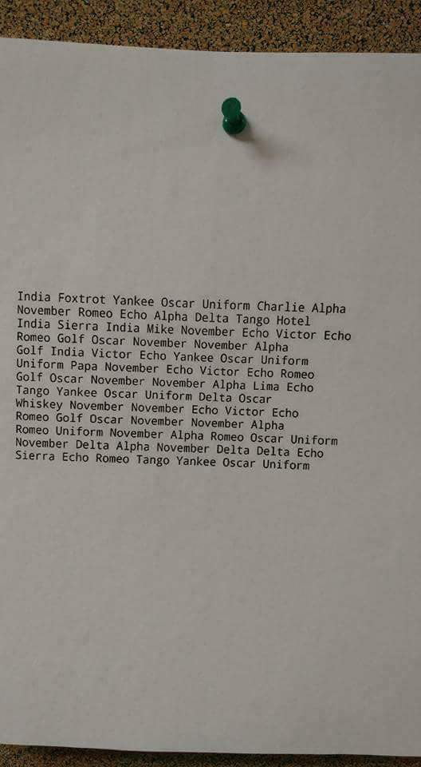

# If you can read this...

## Description

You'll have to translate a string to Pilot's alphabet ([NATO phonetic alphabet](https://en.wikipedia.org/wiki/NATO_phonetic_alphabet)).

### Input

`If, you can read?`

### Output

`India Foxtrot , Yankee Oscar Uniform Charlie Alfa November Romeo Echo Alfa Delta ?`

## Note

* There are preloaded dictionary you can use, named `NATO`.
* The set of used punctuation is `,.!?`.
* Punctuation should be kept in your return string, but spaces should not.
* **Xray** should not have a dash within.
* Every word and punctuation mark should be seperated by a space ' '.
* There should be no trailing whitespace.
