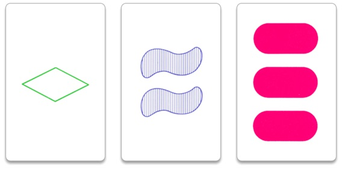

# Is it a Set?

## Description

**set!** is a card game where you compete with other players, to find out who can find a set of cards first.
Your task is to write a function that checks if a collection of three input cards qualifies as a set.

### The cards

Every card has one, two or three symbols in it. A symbol has three distinct features:

* Shape (either `diamond`, `snake` or `capsule`)
* Colour (either `green`, `blue` or `red`)
* Pattern (either `blank`, `striped` or `solid`)

(Image is taken as fair use from Wikipedia.)

### What's a set?

A set always consists of three cards. The set is considered valid if, and only if, every property of the card is either the same as the other two cards, or distinct from the other two. Properties include the three features mentioned above plus the quantity of symbols.

### Input & Output

You will receive an four arrays, containing the properties of the cards. One array, containing the quantity of symbols, will be numeric, the others will contain strings.

It's safe to assume that any card provided will always satisfy the properties outlined above. For example, there will be no card passed with 5 symbols, or with a circle shape.

Your task is to return a boolean, indicating if the given input properties qualify as a valid set - `true` if they do `false` if not.
