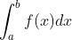
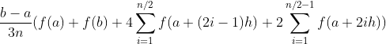
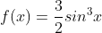

# Simpson's Rule - Approximate Integration

## Description

An integral:

can be approximated by the so-called Simpson’s rule:

Here `h = (b-a)/n`, `n` being an even integer and `a <= b`.

We want to try Simpson's rule with the function f:

The task is to write a function called `simpson` with parameter `n` which returns the value of the integral of f on the interval `[0, pi]` (pi being 3.14159265359...).

## Notes

* Don't round or truncate your results. See in "RUN EXAMPLES" the function `assertFuzzyEquals` or testing.
* `n` will always be even.
* We know that the exact value of the integral of f on the given interval is `2`.
