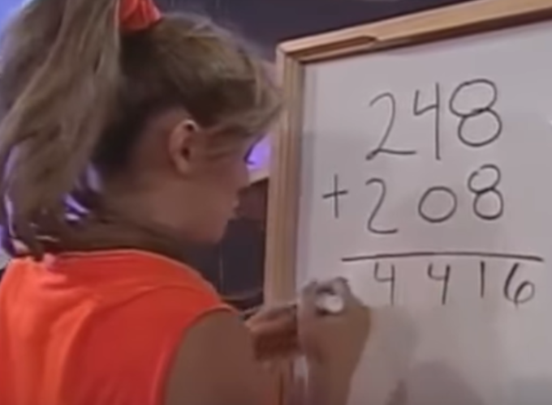

# 16+18=214

## Description

For this Kata you will have to forget how to add two numbers together.

The best explanation on what to do for this kata is this meme :

In simple terms our method does not like the principle of carrying over numbers and just writes down every number it calculates.

`You may assume` both integers are `positive integers` and the `result will not be bigger than Integer.MAX_VALUE` (only for Java).
