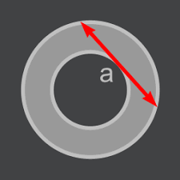

# Area of an annulus

## Description

When given the length of the arrow as `a`, where `a` is an `integer` and `≥ 1`, calculate the area of the annulus (the grey ring).

Round the answer to two decimal places. In case you need `pi`, you can use the standard `Math.PI`/`M_PI`.
