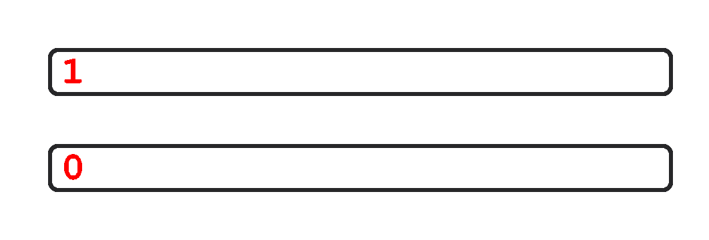

# Genetic Algorithm Series - #2 Mutation

## Description

**Mutation** is a genetic operator used to maintain genetic diversity from one generation of a population of genetic algorithm chromosomes to the next.

A mutation here may happen on zero or more positions in a chromosome. It is going to check every position and by a given probability it will decide if a mutation will occur.

A mutation is the change from `0` to `1` or from `1` to `0`.

_**Note:** Some tests are random. If you think your algorithm is correct but the result fails, trying again should work._
