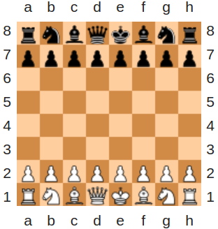

# White or Black

## Description

Complete the function that returns the color of the given square on a normal, 8x8 chess board:



Examples:

```python
"a", 8  ==>  "white"
"b", 2  ==>  "black"
"f", 5  ==>  "white"
```
