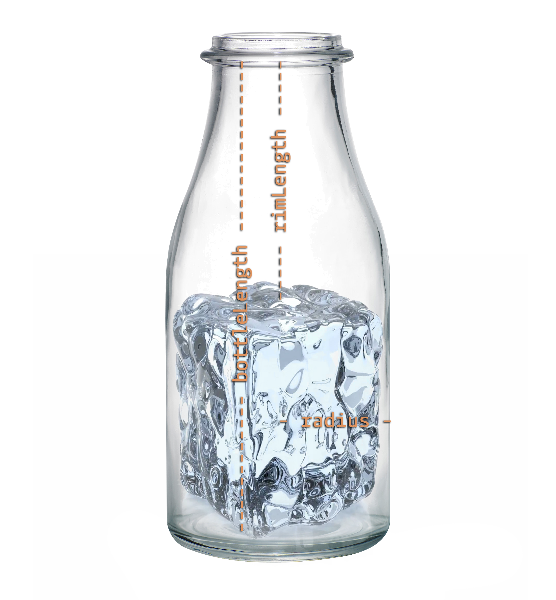

# For Twins: 2. Math operations

## Description

A magician in the subway showed you a trick, he put an ice brick in a bottle to impress you.The bricks width and height are equal, forming a square. Just for fun and also to impress the magician and people around, you decided to calculate the brick's volume. Write a function iceBrickVolume that will except these parameters:

* `radius` - bottle's radius (always > 0);
* `bottleLength` - total bottle length (always > 0);
* `rimLength` - length from bottle top to brick (always < `bottleLength`);

And return volume of ice brick that magician managed to put into a bottle.

